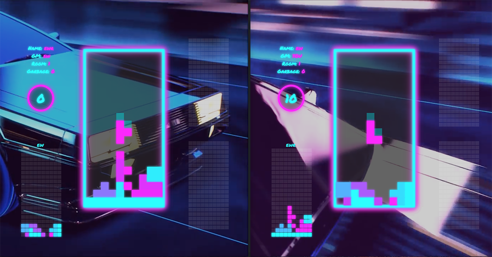

## Description

/!\ THE SCREENSHOTS BELOW DO NOT REPRESENT THE ACTUAL DESIGN ANYMORE AS IT AS BEEN DRASTICALY SIMPLIFIED FOR PERFORMANCE SAKE

Red tetris is a fullstack web application.
It's written in JavaScript with React / Redux on the front-end and Node.js / Express on the back-end.
Red tetris is also a realtime, multiplayer tetris game using socket.io.

## Getting Started

`docker run -p 8080:8080 narajaon/red_tetris`

Then go to `localhost:8080` in your browser

## Usage

Move piece :		`Arrow keys`  
Rotate piece :		`R`  

Enter a name and a roome

You can play by yourself

Or with friends

